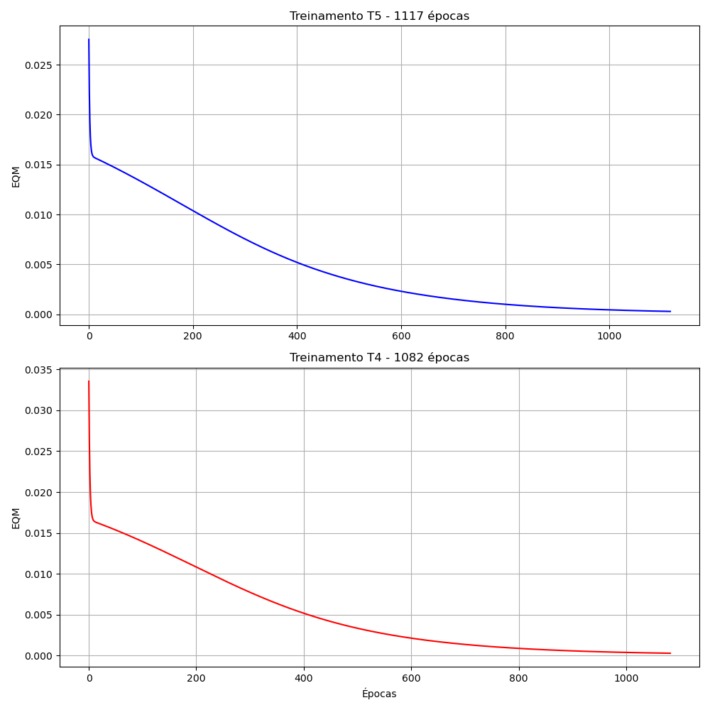

## 1. Implementação e Resultados de Estimação (PMC)

A rede Perceptron Multicamadas foi configurada com uma camada escondida de 3 neurônios (Topologia [3 x 3 x 1]). Foram seguidos os parâmetros: inicialização aleatória [0, 1], função logística, $\eta = 0.1$ e $\epsilon = 10^{-6}$.

### Tabela de Estimação de Energia ($y_{rede}$) vs Target ($d$)

| Amostra | Target ($d$) | $y (T1)$ | $y (T2)$ | $y (T3)$ | $y (T4)$ | $y (T5)$ |
| :---: | :---: | :---: | :---: | :---: | :---: | :---: |
| 1 | 0.4831 | 0.4834 | 0.4838 | 0.4849 | 0.4851 | 0.4828 |
| 2 | 0.5965 | 0.6012 | 0.6046 | 0.6037 | 0.6018 | 0.6064 |
| 3 | 0.5318 | 0.5214 | 0.5243 | 0.5239 | 0.5246 | 0.5254 |
| 4 | 0.6843 | 0.7076 | 0.7067 | 0.7066 | 0.7060 | 0.7076 |
| 5 | 0.2872 | 0.3224 | 0.3205 | 0.3186 | 0.3234 | 0.3200 |
| 6 | 0.7663 | 0.7330 | 0.7314 | 0.7312 | 0.7320 | 0.7305 |
| 7 | 0.5666 | 0.5782 | 0.5772 | 0.5788 | 0.5747 | 0.5755 |
| 8 | 0.6601 | 0.6569 | 0.6556 | 0.6564 | 0.6570 | 0.6554 |
| 9 | 0.5427 | 0.5559 | 0.5581 | 0.5582 | 0.5538 | 0.5577 |
| 10 | 0.5836 | 0.5962 | 0.5945 | 0.5965 | 0.5943 | 0.5931 |
| 11 | 0.6950 | 0.6686 | 0.6681 | 0.6681 | 0.6692 | 0.6685 |
| 12 | 0.6790 | 0.6782 | 0.6780 | 0.6782 | 0.6767 | 0.6789 |
| 13 | 0.2956 | 0.3262 | 0.3248 | 0.3238 | 0.3267 | 0.3248 |
| 14 | 0.7742 | 0.7640 | 0.7634 | 0.7633 | 0.7643 | 0.7654 |
| 15 | 0.4662 | 0.4681 | 0.4681 | 0.4692 | 0.4691 | 0.4667 |
| 16 | 0.8093 | 0.7916 | 0.7911 | 0.7888 | 0.7920 | 0.7897 |
| 17 | 0.7581 | 0.7476 | 0.7471 | 0.7462 | 0.7471 | 0.7475 |
| 18 | 0.5826 | 0.5870 | 0.5904 | 0.5890 | 0.5894 | 0.5923 |
| 19 | 0.7938 | 0.7807 | 0.7796 | 0.7786 | 0.7812 | 0.7805 |
| 20 | 0.5012 | 0.4986 | 0.4984 | 0.4998 | 0.4987 | 0.4970 |

---

### Desempenho Estatístico do Modelo

| Métrica | T1 | T2 | T3 | T4 | T5 |
| :--- | :---: | :---: | :---: | :---: | :---: |
| **Erro Relativo Médio (%)** | 2.6215 | 2.6334 | 2.6307 | 2.6008 | 2.6044 |
| **Variância do Erro (%)** | 9.8498 | 8.6989 | 7.8478 | 10.1739 | 8.6710 |

---

## 2. Resultados Finais dos Treinamentos (PMC)

Abaixo estão registrados os resultados de convergência para os 5 treinamentos realizados com a rede Perceptron Multicamadas.

| Treinamento | Erro Quadrático Médio (EQM) | Número de Épocas |
| :--- | :---: | :---: |
| **1º (T1)** | 2.9344 x 10^-4 | 1063 |
| **2º (T2)** | 2.9287 x 10^-4 | 1086 |
| **3º (T3)** | 2.9436 x 10^-4 | 1070 |
| **4º (T4)** | 2.8664 x 10^-4 | 957 |
| **5º (T5)** | 2.9389 x 10^-4 | 1113 |

## 3. Evolução do Erro Quadrático Médio (Maiores Épocas)

Para cumprir o requisito de análise das curvas de aprendizado mais longas, foram selecionados os treinamentos **T5 (1117 épocas)** e **T4 (1082 épocas)**. Os gráficos abaixo apresentam a descida do erro quadrático médio em função das épocas, dispostos de forma a permitir a visualização individual de cada convergência.

---

## 4. Análise da Variação de Épocas e EQM

**Pergunta:** Baseado na tabela do item 2, explique de forma detalhada por que tanto o erro quadrático médio quanto o número de épocas variam de treinamento para treinamento.

**Resposta:** Essa variação ocorre devido à **natureza estocástica da inicialização dos pesos** da rede PMC. 

1. **Variação das Épocas:** Como cada treinamento inicia com pesos aleatórios entre 0 e 1, a rede começa a busca pelo erro mínimo a partir de uma posição diferente no "espaço de busca". Se os pesos iniciais estiverem, por sorte, mais próximos de uma configuração favorável, a rede precisará de menos ajustes (menos épocas) para atingir a precisão $\epsilon = 10^{-6}$. Se começarem em uma posição desfavorável, o gradiente descendente precisará de mais iterações para convergir.

2. **Variação do EQM Final:** Embora a rede busque o mesmo objetivo, a superfície de erro de uma MLP é altamente complexa e cheia de **mínimos locais**. Diferentes inicializações podem levar a rede a se estabilizar em "vales" de erro ligeiramente distintos. Além disso, o critério de parada é baseado na diferença entre o erro da época atual e da anterior; portanto, a rede para assim que a evolução se torna menor que a precisão solicitada, o que pode resultar em valores de EQM final próximos, mas não idênticos.

## 5. Validação da Rede e Análise de Erros

Nesta etapa, validamos o desempenho dos 5 modelos treinados aplicando o conjunto de dados de teste. A tabela abaixo apresenta os valores estimados pela rede ($y_{rede}$) para cada treinamento, seguidos pelo Erro Relativo Médio e pela Variância.

### Tabela de Validação dos Modelos

| Amostra | Target ($d$) | $y (T1)$ | $y (T2)$ | $y (T3)$ | $y (T4)$ | $y (T5)$ |
| :---: | :---: | :---: | :---: | :---: | :---: | :---: |
| 1 | 0.4831 | 0.4834 | 0.4838 | 0.4849 | 0.4851 | 0.4828 |
| 2 | 0.5965 | 0.6012 | 0.6046 | 0.6037 | 0.6018 | 0.6064 |
| 3 | 0.5318 | 0.5214 | 0.5243 | 0.5239 | 0.5246 | 0.5254 |
| 4 | 0.6843 | 0.7076 | 0.7067 | 0.7066 | 0.7060 | 0.7076 |
| 5 | 0.2872 | 0.3224 | 0.3205 | 0.3186 | 0.3234 | 0.3200 |
| 6 | 0.7663 | 0.7330 | 0.7314 | 0.7312 | 0.7320 | 0.7305 |
| 7 | 0.5666 | 0.5782 | 0.5772 | 0.5788 | 0.5747 | 0.5755 |
| 8 | 0.6601 | 0.6569 | 0.6556 | 0.6564 | 0.6570 | 0.6554 |
| 9 | 0.5427 | 0.5559 | 0.5581 | 0.5582 | 0.5538 | 0.5577 |
| 10 | 0.5836 | 0.5962 | 0.5945 | 0.5965 | 0.5943 | 0.5931 |
| 11 | 0.6950 | 0.6686 | 0.6681 | 0.6681 | 0.6692 | 0.6685 |
| 12 | 0.6790 | 0.6782 | 0.6780 | 0.6782 | 0.6767 | 0.6789 |
| 13 | 0.2956 | 0.3262 | 0.3248 | 0.3238 | 0.3267 | 0.3248 |
| 14 | 0.7742 | 0.7640 | 0.7634 | 0.7633 | 0.7643 | 0.7654 |
| 15 | 0.4662 | 0.4681 | 0.4681 | 0.4692 | 0.4691 | 0.4667 |
| 16 | 0.8093 | 0.7916 | 0.7911 | 0.7888 | 0.7920 | 0.7897 |
| 17 | 0.7581 | 0.7476 | 0.7471 | 0.7462 | 0.7471 | 0.7475 |
| 18 | 0.5826 | 0.5870 | 0.5904 | 0.5890 | 0.5894 | 0.5923 |
| 19 | 0.7938 | 0.7807 | 0.7796 | 0.7786 | 0.7812 | 0.7805 |
| 20 | 0.5012 | 0.4986 | 0.4984 | 0.4998 | 0.4987 | 0.4970 |
| **Erro Relativo Médio (%)** | **2.6215** | **2.6334** | **2.6307** | **2.6008** | **2.6044** |
| **Variância (%)** | **9.8498** | **8.6989** | **7.8478** | **10.1739** | **8.6710** |